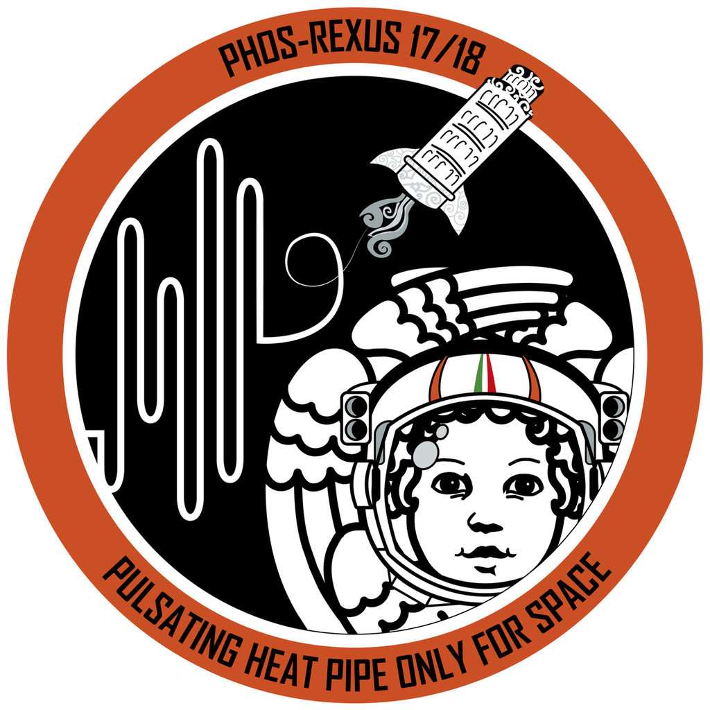
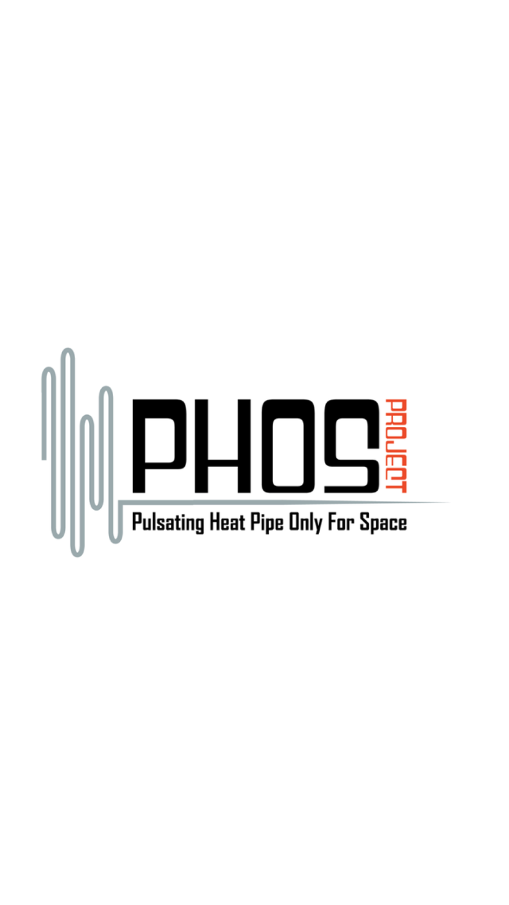
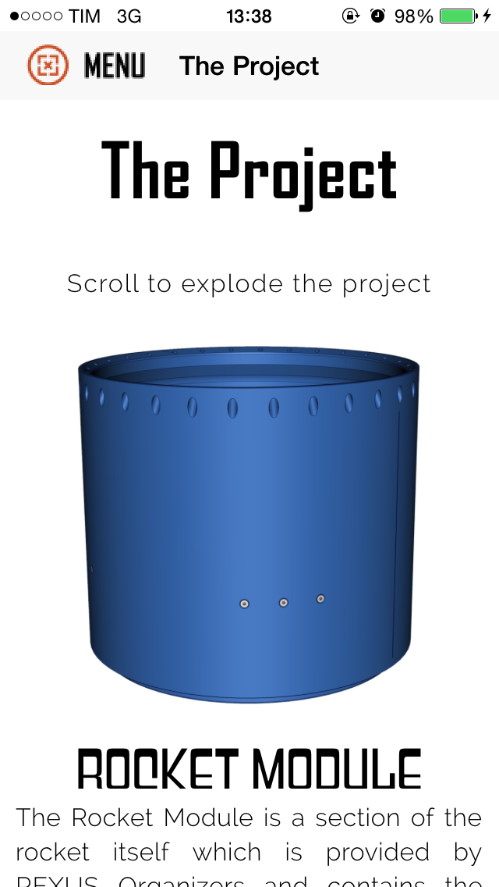
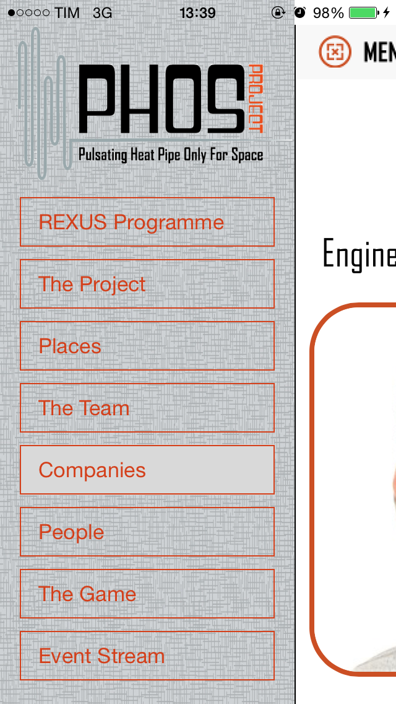
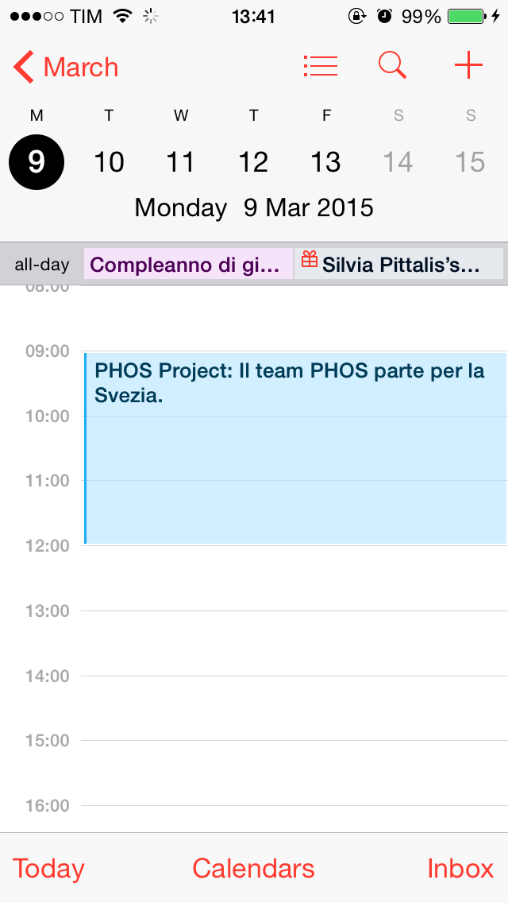

# PHOS App
Applicazione iOS e Android realizzata per il progetto PHOS dell'Università di Pisa.

Applicazione PHOS su Google Play Store: https://play.google.com/store/apps/details?id=com.phos.rambodrahmani.phos

Applicazione PHOS su Apple App Store: https://itunes.apple.com/it/app/phos/id964885582

Alcune screen dell'APP di seguito.

    

##### Maggiori informazioni disponibili sul mio profilo Linkedin: https://www.linkedin.com/in/rambodrahmani

Rambod Rahmani <<rambodrahmani@autistici.org>>
